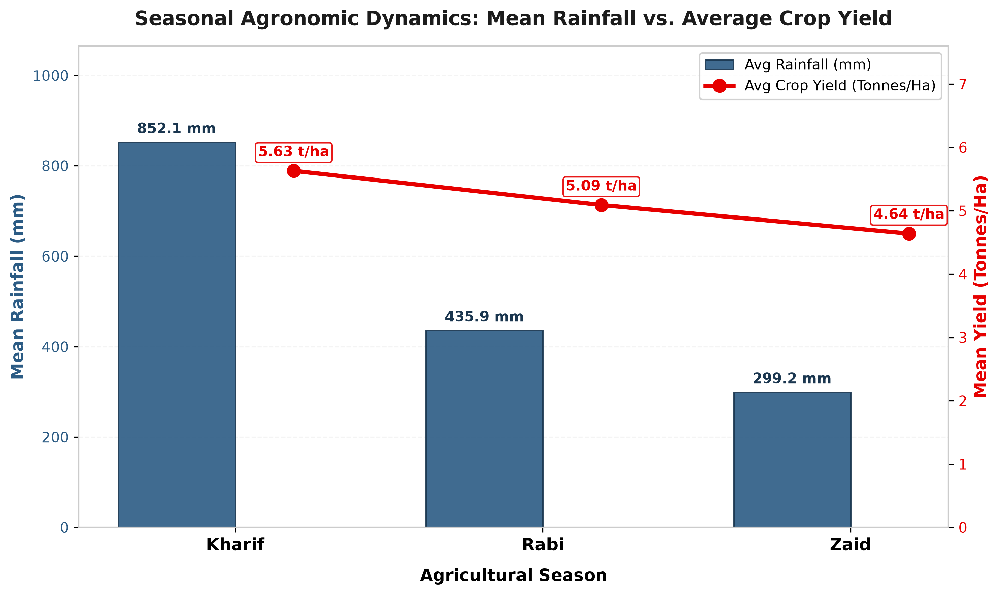
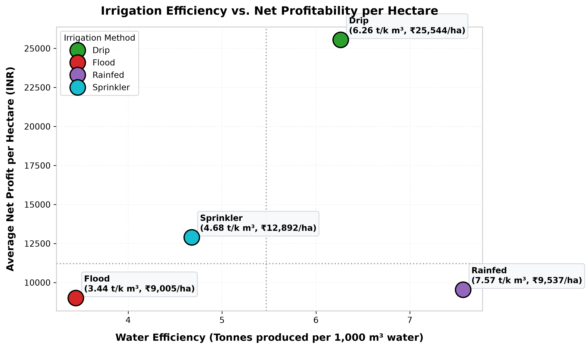
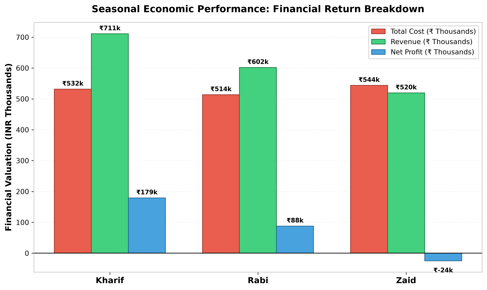
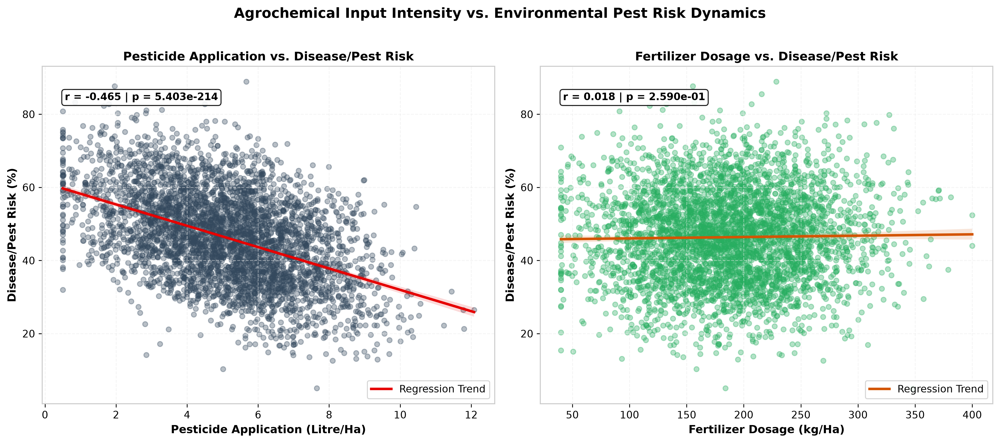
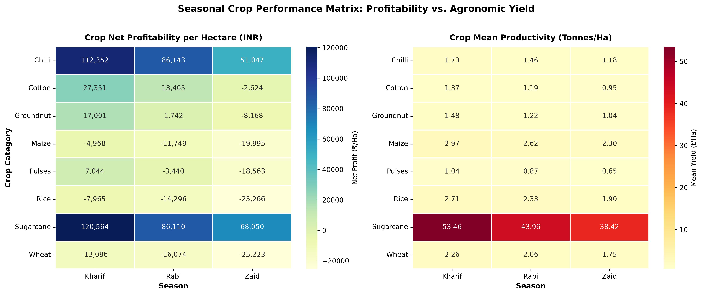

# Seasonal Agriculture Performance Analysis
### VOIS AICTE Internship (Batch 1: 2026-2027) — Major Project


[](https://colab.research.google.com/github/princex100/VOIS-Seasonal-Agriculture-Performance-Analysis/blob/main/notebooks/Seasonal_Agriculture_Performance_Analysis.ipynb)


---

## ⚡ 1-Click Interactive Execution on Google Colab

Run this entire project directly in your browser without local installation:
👉 **[Open In Google Colab](https://colab.research.google.com/github/princex100/VOIS-Seasonal-Agriculture-Performance-Analysis/blob/main/notebooks/Seasonal_Agriculture_Performance_Analysis.ipynb)**

---

## 📌 Project Abstract

Agricultural productivity in India is governed by complex dynamics of seasonal cycles (**Kharif, Rabi, and Zaid**), irrigation infrastructure, and chemical input intensity. This major project presents an empirical data science study analyzing **4,000 farm observations** across 8 major Indian agrarian states (*Andhra Pradesh, Gujarat, Karnataka, Madhya Pradesh, Maharashtra, Punjab, Tamil Nadu, and Telangana*).

Through statistical hypothesis testing (ANOVA & Kruskal-Wallis), stratified median imputation, and visual analytics, this project quantifies:
1. **Seasonal Macro-Economics:** Kharif generates peak profitability (**₹179,338/farm**, **₹21,973/Ha**), driven by monsoon rains (**852.1 mm**). Rabi offers steady positive returns (**₹88,074/farm**, **₹10,429/Ha**), while Zaid suffers from severe financial deficit (**-₹24,452/farm net loss**) due to extreme summer pumping costs ($F = 34.40, p = 1.54 \times 10^{-15}$).
2. **Irrigation Disparities:** **Drip irrigation** achieves highest net profit (**₹25,544/Ha**) and water productivity (**6.26 t/1,000 m³**), while **Flood irrigation** is least efficient (**3.44 t/1,000 m³**) and lowest in profit (**₹9,005/Ha**).
3. **Agrochemical Risk:** Pest/disease risk surges to **54.47%** in Kharif monsoon humidity, with chemical over-dosage showing weak linear efficacy without timing telemetry.

---

## 📊 Key Analytical Summary Table

| Metric | Kharif (Monsoon) | Rabi (Winter) | Zaid (Summer) | Overall / Best Practice |
| :--- | :---: | :---: | :---: | :---: |
| **Sample Farm Count** | 1,779 (44.5%) | 1,627 (40.7%) | 594 (14.8%) | **4,000 Farms** |
| **Mean Rainfall (mm)** | **852.10 mm** | 435.95 mm | 299.16 mm | 599.98 mm |
| **Average Crop Yield (t/Ha)** | **5.63 t/Ha** | 5.09 t/Ha | 4.64 t/Ha | 5.26 t/Ha |
| **Median Crop Yield (t/Ha)** | **1.95 t/Ha** | 1.66 t/Ha | 1.45 t/Ha | 1.74 t/Ha |
| **Average Production (Tonnes)** | **46.85 Tonnes** | 41.20 Tonnes | 37.80 Tonnes | 43.20 Tonnes |
| **Average Revenue (INR)** | **₹7,11,143** | ₹6,01,911 | ₹5,19,524 | ₹6,38,284 |
| **Average Total Cost (INR)** | ₹5,31,804 | **₹5,13,837** | ₹5,43,977 | ₹5,26,307 |
| **Average Net Profit (INR)** | **+₹1,79,338** | +₹88,074 | **-₹24,452** | +₹1,11,977 |
| **Net Profit per Hectare** | **₹21,973/Ha** | ₹10,429/Ha | -₹2,519/Ha | ₹13,639/Ha |
| **Disease / Pest Risk (%)** | **54.47%** | 40.48% | 38.22% | 46.36% |
| **Optimal Irrigation Mode** | Drip / Rainfed | Drip / Sprinkler | Drip (Solar-Powered) | **Drip (₹25,544/Ha)** |

---

## 📈 Visual Analytics & Key Figures

### 1. Seasonal Agronomic Dynamics (Yield vs. Rainfall)

*Dual-axis visualization illustrating precipitation regimes against mean agricultural productivity.*

---

### 2. Irrigation Efficiency vs. Net Profitability per Hectare

*Water efficiency ($t/1,000 m^3$) versus net profit per hectare across Drip, Sprinkler, Rainfed, and Flood irrigation methods.*

---

### 3. Seasonal Macroeconomic Breakdown

*Grouped financial breakdown comparing Total Cost, Revenue, and Net Profit across Kharif, Rabi, and Zaid cycles.*

---

### 4. Agrochemical Application vs. Pest/Disease Vulnerability

*Linear regression analysis examining chemical dosage against environmental pest risk percentages.*

---

### 5. Crop-Season Performance Matrix

*Heatmaps evaluating net profitability (₹/Ha) and crop productivity (Tonnes/Ha) across crop varieties and seasons.*

---

## 📁 Repository Directory Structure

```text
vois-final-project/
│
├── data/
│   ├── seasonal_agriculture_performance_dataset (1).csv   # Raw 4,000-sample dataset
│   └── cleaned_agricultural_data.csv                      # Imputed & verified dataset
│
├── notebooks/
│   └── Seasonal_Agriculture_Performance_Analysis.ipynb    # Documented Jupyter research notebook
│
├── src/
│   ├── analyze_and_visualize.py                           # Data pipeline & visualization module
│   └── update_presentation.py                             # Automated 14-slide PPT deck builder
│
├── results/
│   ├── 01_seasonal_yield_rainfall.png                     # Dual-axis chart
│   ├── 02_irrigation_profit_efficiency.png                # Scatter chart
│   ├── 03_economic_returns_season.png                     # Grouped bar chart
│   ├── 04_pesticide_fertilizer_pest_risk.png              # Regression subplots
│   ├── 05_crop_performance_matrix.png                     # Agronomic heatmap matrix
│   └── statistical_summary.json                           # Computed ANOVA and summary KPIs
│
├── docs/
│   └── VOIS_Major_Project_Final_Submission.pptx           # 14-slide Widescreen Presentation Deck
│
├── .gitignore                                             # Version control ignore list
└── README.md                                              # Comprehensive project documentation
```

---

## 🚀 Quickstart & Reproduction Guide

### 1. Prerequisites
Ensure Python 3.10+ is installed:
```bash
python --version
```

### 2. Install Required Dependencies
```bash
pip install pandas numpy matplotlib seaborn scipy statsmodels python-pptx nbformat
```

### 3. Run Exploratory Data Analysis & Generate Visualizations
```bash
python src/analyze_and_visualize.py
```

### 4. Generate PowerPoint Presentation Deck
```bash
python src/update_presentation.py
```

### 5. Execute Jupyter Research Notebook
```bash
jupyter notebook notebooks/Seasonal_Agriculture_Performance_Analysis.ipynb
```

---

## 📤 Step-by-Step GitHub Submission Instructions

1. **Create an empty repository on GitHub**:
   - Repository Name: `VOIS-Seasonal-Agriculture-Performance-Analysis`
   - Access: **Public** (Leave uninitialized without README or .gitignore).

2. **Link local repository and push**:
   ```bash
   git branch -M main
   git remote add origin https://github.com/<YOUR-GITHUB-USERNAME>/VOIS-Seasonal-Agriculture-Performance-Analysis.git
   git push -u origin main
   ```

3. **Final Submission Checklist**:
   - [ ] Open `docs/VOIS_Major_Project_Final_Submission.pptx` and fill in `[Student Name]`, `[College Name]`, and `[AICTE STU ID]` on Slide 1.
   - [ ] Replace `<YOUR-USERNAME>` on Slide 12 with your actual GitHub URL.
   - [ ] Paste your VOIS Data Visualization course completion certificate into Slide 13.
   - [ ] Export presentation to PDF if required by the AICTE internship portal.

---
**VOIS AICTE Internship Batch 1 (2026-2027) | Vodafone Intelligent Solutions**
